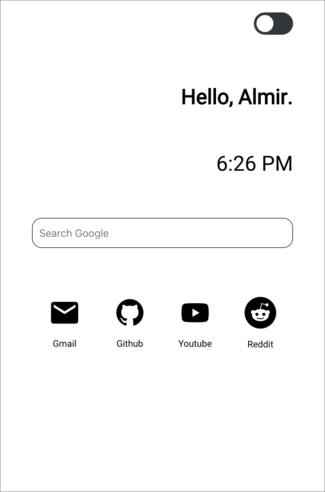
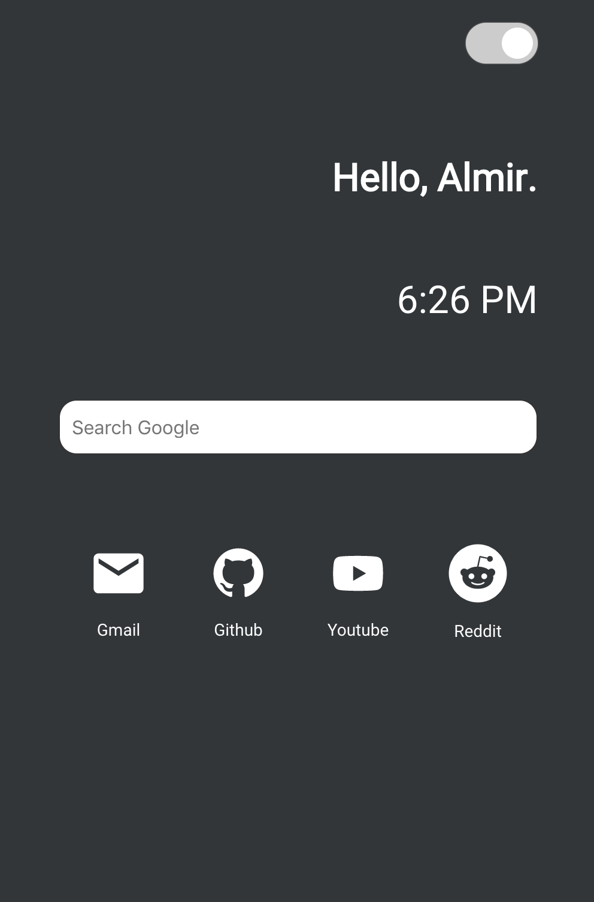

# Start page
Start page project | React hooks practice

**current work in progress**

Light mode           |  Dark mode
:-------------------------:|:-------------------------:
  |  

<h3>To do list</h3>

- [x] Create light / dark mode

- [x] Use React state to store which mode it's in

- [x] Practice using React hooks

- [x] Successfully update clock in realtime using hooks

- [x] Implement switch to toggle between two modes

- [x] Styled icons for site bookmarks

- [x] Passing data into each bookmark component

- [ ] Locally store which mode a user was on last visit

- [ ] Add a headline / articles section for up to date news feed using async fetch api

- [ ] Possibly add weather / temperature sections using async fetch api
